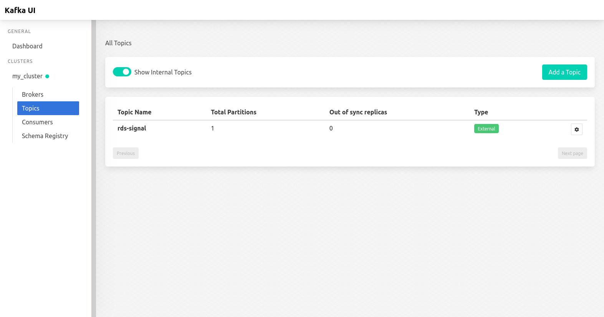

# FMap-server
Monitora la qualità della ricezione dei segnali radio nelle province siciliane. 


## Conversion data

Frequency - StationName maps are stored in scraper/data/ directory: 

| Province | URL                                                          |
| -------- | ------------------------------------------------------------ |
| Catania  | [Link to Catania csv](https://github.com/triglie/FMap-server/blob/main/scrapers/data/fm-station-map-catania.csv) |
| Messina  | [Link to Messina csv](https://github.com/triglie/FMap-server/blob/main/scrapers/data/fm-station-map-messina.csv) |
| Palermo  | [Link to Palermo csv](https://github.com/triglie/FMap-server/blob/main/scrapers/data/fm-station-map-palermo.csv) |

> Any other province outside of this three uses the csv of the nearest province. 

Frequency - PI - StationName map is stored in scraper/data/ directory: 

| State    | URL                                                          |
| -------- | ------------------------------------------------------------ |
| Italia   | [Link to National FM map csv](https://github.com/triglie/FMap-server/blob/main/scrapers/data/complete-pi-station-map.csv) |


## Adding station names with Kafka 

When Kafka receives a message, it attachs the station name to it using the PI (programme identifier) or the FM. The csv stored in scraper/data are used as lookup tables to do the conversion. To compile the java application you need to install: 

* java 8 (sdk & jvm)
* maven

 Then go to data-enrichment/fmap.server/ and run

```shell
$ mvn package
```

[...]

## Kafka UI 

After starting kafka, go to http://localhost:8080/ to access the Kafka UI. 

